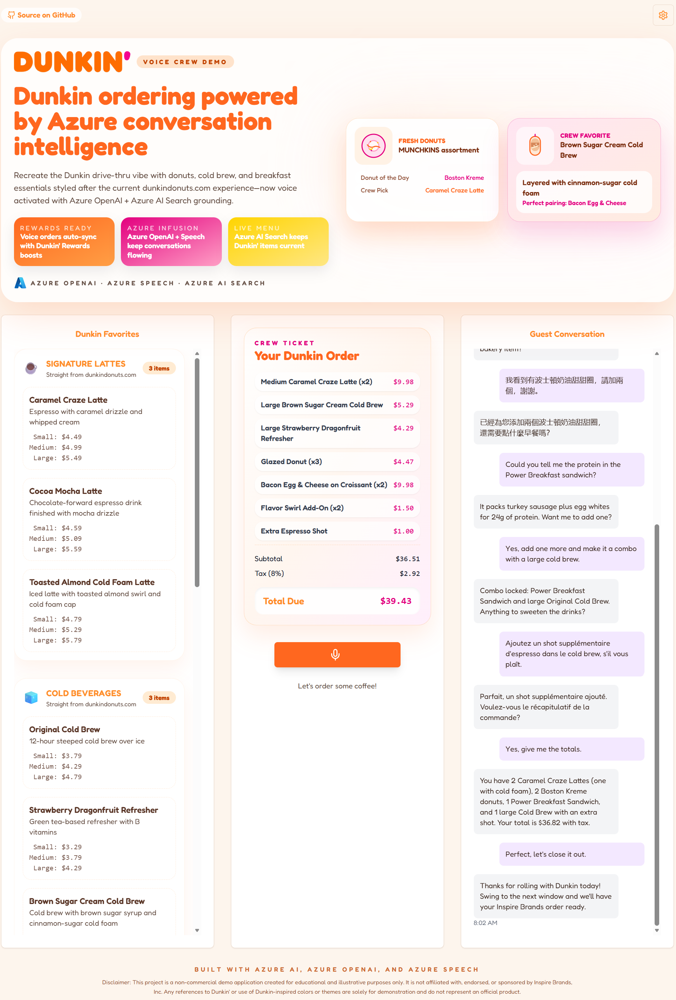

# Dunkin Voice Chat Assistant

Dunkin Voice Chat Assistant is an Inspire Brands–themed, voice-driven ordering experience that showcases Microsoft best practices for Azure OpenAI GPT-4o Realtime, Azure AI Search, and Azure Container Apps. The experience emulates a Dunkin crew member who can search the official menu, hold multilingual conversations, and keep orders in sync across devices.

As guests speak, real-time transcription, translation, and order management provide a transparent view of every choice...from signature lattes to bakery classics. The UI applies Dunkin's vibrant design language so stakeholders can picture how voice AI augments drive-thru, curbside, and kiosk flows.

Beyond coffee fans, this sample demonstrates how Microsoft’s Responsible AI guidance plus Azure-first tooling enable inclusive, hands-free interactions for franchise teams, accessibility scenarios, and mixed fleet deployments across the Inspire Brands portfolio.

## Table of Contents

- [Dunkin Voice Chat Assistant](#dunkin-voice-chat-assistant)
  - [Table of Contents](#table-of-contents)
  - [Acknowledgment](#acknowledgment)
  - [Visual Demonstrations](#visual-demonstrations)
    - [Desktop 4 Minute Interaction Big Order Demo](#desktop-4-minute-interaction-big-order-demo)
    - [Mobile Multilingual Ordering Demo](#mobile-multilingual-ordering-demo)
    - [UI Elements Walkthrough](#ui-elements-walkthrough)
  - [Features](#features)
    - [Architecture Diagram](#architecture-diagram)
  - [Getting Started](#getting-started)
    - [GitHub Codespaces](#github-codespaces)
    - [VS Code Dev Containers](#vs-code-dev-containers)
    - [Local environment](#local-environment)
  - [Ingesting Menu Items into Azure AI Search](#ingesting-menu-items-into-azure-ai-search)
    - [From JSON](#from-json)
      - [Steps (JSON)](#steps-json)
    - [From PDF](#from-pdf)
      - [Steps (PDF)](#steps-pdf)
  - [Running the App Locally](#running-the-app-locally)
    - [Option 1: Direct Local Execution (Recommended for Development)](#option-1-direct-local-execution-recommended-for-development)
    - [Option 2: Docker-based Local Execution](#option-2-docker-based-local-execution)
  - [Deploying to Azure](#deploying-to-azure)
  - [Contributing](#contributing)
  - [Resources](#resources)

## Acknowledgment

This project extends the [VoiceRAG Repository](https://github.com/Azure-Samples/aisearch-openai-rag-audio), adapting its Microsoft-first architecture for a Dunkin scenario. Review the original pattern in this [blog post](https://aka.ms/voicerag). For the upstream README, see [voice_rag_README.md](voice_rag_README.md).

Special thanks to [John Carroll](https://github.com/john-carroll-sw) for the original [coffee-chat-voice-assistant](https://github.com/john-carroll-sw/coffee-chat-voice-assistant) that inspired this sample. This fork updates to the latest OpenAI models and stirs in a few extra flavors—call it my own brew of the solution.

## Visual Demonstrations



## Features

- **Dunkin-specific conversational AI**: GPT-4o Realtime is constrained to verified menu data through Azure AI Search so it always sounds like a Dunkin crew member.
- **Retrieval-Augmented Generation (RAG)**: Azure OpenAI tool-calling plus semantic hybrid search keep recommendations grounded with pricing, nutrition, and add-on guidance.
- **Real-Time Transcription + Translation**: Multilingual guests receive accurate transcripts in their language of choice with instant pivots between English, Spanish, Mandarin, French, and more.
- **Live Order Synchronization**: Function calls update the shared cart so kiosk screens, mobile devices, and drive-thru headsets stay aligned without race conditions.
- **Audio Output + Accessibility**: Browser audio playback mirrors what a guest would hear over drive-thru speakers, supporting screenless or low-vision ordering.
- **Durable Session Tokens**: Every realtime conversation emits a session token plus per-turn identifiers so transcripts can map back to telemetry, QA findings, or Azure logs.

### Architecture Diagram

The `RTClient` in the frontend receives the audio input, sends that to the Python backend which uses an `RTMiddleTier` object to interface with the Azure OpenAI real-time API, and includes a tool for searching Azure AI Search.


This repository includes infrastructure as code and a `Dockerfile` to deploy the app to Azure Container Apps, but it can also be run locally as long as Azure AI Search and Azure OpenAI services are configured.

## Getting Started

You have a few options for getting started with this template. The quickest way to get started is [GitHub Codespaces](#github-codespaces), since it will setup all the tools for you, but you can also [set it up locally](#local-environment). You can also use a [VS Code dev container](#vs-code-dev-containers)

### GitHub Codespaces

You can run this repo virtually by using GitHub Codespaces, which opens a web-based VS Code in your browser:

1. In your forked GitHub repository, select **Code ➜ Codespaces ➜ Create codespace on main**.
2. Choose a machine type with at least 8 cores (the 32 GB option provides the smoothest dev experience).
3. After the container finishes provisioning, open a new terminal and proceed to [deploying the app](#deploying-to-azure).

### VS Code Dev Containers

You can run the project in your local VS Code Dev Container using the [Dev Containers extension](https://marketplace.visualstudio.com/items?itemName=ms-vscode-remote.remote-containers):

1. Start Docker Desktop (install it if not already installed).
2. Clone your GitHub repository locally (see [Local environment](#local-environment)).
3. Open the folder in VS Code and choose **Reopen in Container** when prompted (or run the **Dev Containers: Reopen in Container** command).
4. After the container finishes building, open a new terminal and proceed to [deploying the app](#deploying-to-azure).

### Local environment

1. Install the required tools by running the prerequisites script:

  ```bash
  # Make the script executable
  chmod +x ./scripts/install_prerequisites.sh
   
  # Run the script
  ./scripts/install_prerequisites.sh
  ```

  The script installs the Azure CLI, signs you in, and verifies Docker availability for you.

  Alternatively, manually install [Azure Developer CLI](https://aka.ms/azure-dev/install), [Node.js](https://nodejs.org/), [Python >=3.11](https://www.python.org/downloads/), [Git](https://git-scm.com/downloads), and [Docker Desktop](https://www.docker.com/products/docker-desktop).
  2. Clone your GitHub repository (`git clone https://github.com/swigerb/dunkin-chat-voice-assistant.git`)
  3. Proceed to the next section to [deploy the app](#deploying-to-azure).

## Ingesting Menu Items into Azure AI Search

### From JSON

If you have a JSON file containing the menu items for your café, you can use the provided Jupyter notebook to ingest the data into Azure AI Search.

#### Steps (JSON)

1. Open the `menu_ingestion_search_json.ipynb` notebook.
2. Follow the instructions to configure Azure OpenAI and Azure AI Search services.
3. Prepare the JSON data for ingestion.
4. Upload the prepared data to Azure AI Search.

This notebook demonstrates how to configure Azure OpenAI and Azure AI Search services, prepare the JSON data for ingestion, and upload the data to Azure AI Search for hybrid semantic search capabilities.

[Link to JSON Ingestion Notebook](scripts/menu_ingestion_search_json.ipynb)

### From PDF

If you have a PDF file of a café's menu that you would like to use, you can use the provided Jupyter notebook to extract text from the PDF, parse it into structured JSON format, and ingest the data into Azure AI Search.

#### Steps (PDF)

1. Open the `menu_ingestion_search_pdf.ipynb` notebook.
2. Follow the instructions to extract text from the PDF using OCR.
3. Parse the extracted text using GPT-4o into structured JSON format.
4. Configure Azure OpenAI and Azure AI Search services.
5. Prepare the parsed data for ingestion.
6. Upload the prepared data to Azure AI Search.

This notebook demonstrates how to extract text from a menu PDF using OCR, parse the extracted text into structured JSON format, configure Azure OpenAI and Azure AI Search services, prepare the parsed data for ingestion, and upload the data to Azure AI Search for hybrid semantic search capabilities.

[Link to PDF Ingestion Notebook](scripts/menu_ingestion_search_pdf.ipynb)

## Running the App Locally

You have two options for running the app locally for development and testing:

### Option 1: Direct Local Execution (Recommended for Development)

Run this app locally using the provided start scripts:

1. Create an `app/backend/.env` file with the necessary environment variables. You can use the provided sample file as a template:

   ```shell
   cp app/backend/.env-sample app/backend/.env
   ```

   Then, fill in the required values in the `app/backend/.env` file.

2. Run this command to start the app:

   Windows:

   ```pwsh
   pwsh .\scripts\start.ps1
   ```

   Linux/Mac:

   ```bash
   ./scripts/start.sh
   ```

3. The app will be available at [http://localhost:8000](http://localhost:8000)

### Option 2: Docker-based Local Execution

For testing in an isolated container environment:

1. Make sure you have an `.env` file in the `app/backend/` directory as described above.

2. Run the Docker build script:

   ```bash
   # Make the script executable
   chmod +x ./scripts/docker-build.sh
   
   # Run the build script
   ./scripts/docker-build.sh
   ```

   This script automatically handles:
   - Verifying/creating frontend environment variables
   - Building the Docker image with proper environment settings
   - Running the container with your backend configuration

3. Navigate to [http://localhost:8000](http://localhost:8000) to use the application.

Alternatively, you can manually build and run the Docker container:

```bash
# Build the Docker image
docker build -t coffee-chat-app \
  --build-arg VITE_AUTH_URL="https://your-auth-url.com" \
  --build-arg VITE_AUTH_ENABLED="true" \
  -f ./app/Dockerfile ./app

# Run the container with your environment variables
docker run -p 8000:8000 --env-file ./app/backend/.env coffee-chat-app:latest
```

## Deploying to Azure

To deploy the app to a production environment in Azure:

1. Make sure you have an `.env` file set up in the `app/backend/` directory. You can copy the sample file:

   ```bash
   cp app/backend/.env-sample app/backend/.env
   ```

2. Run the deployment script with minimal parameters:

   ```bash
   # Make the script executable
   chmod +x ./scripts/deploy.sh
   
   # Run the deployment with just the app name (uses all defaults)
   ./scripts/deploy.sh <name-of-your-app>
   ```

   The script will automatically:
   - Look for backend environment variables in `./app/backend/.env`
   - Look for or create frontend environment variables in `./app/frontend/.env`
   - Use the Dockerfile at `./app/Dockerfile`
   - Use the Docker context at `./app`
   
3. For more control, you can specify custom paths:

   ```bash
   ./scripts/deploy.sh \
     --env-file /path/to/custom/backend.env \
     --frontend-env-file /path/to/custom/frontend.env \
     --dockerfile /path/to/custom/Dockerfile \
     --context /path/to/custom/context \
     <name-of-your-app>
   ```

4. After deployment completes, your app will be available at the URL displayed in the console.

## License

This project is licensed under the [MIT License](LICENSE). You may use, copy, modify, merge, publish, distribute, sublicense, and/or sell copies of the software, provided that the copyright notice and permission notice from the MIT License are included in all copies or substantial portions of the software. Refer to the [LICENSE](LICENSE) file for the complete terms.

## Contributing

Contributions are welcome! Please review [CONTRIBUTING.md](CONTRIBUTING.md) for environment setup, branching guidance, and the pre-flight test checklist before opening an issue or submitting a pull request.

## Disclaimer
All trademarks and brand references belong to their respective owners.

The diagrams, images, and code samples in this repository are provided **AS IS** for **proof-of-concept and pilot purposes only** and are **not intended for production use**.

These materials are provided without warranty of any kind and **do not constitute an offer, commitment, or support obligation** on the part of Microsoft. Microsoft does not guarantee the accuracy or completeness of any information contained herein.

**MICROSOFT MAKES NO WARRANTIES, EXPRESS OR IMPLIED**, including but not limited to warranties of merchantability, fitness for a particular purpose, or non-infringement.

Use of these materials is at your own risk.

## Resources

- [OpenAI Realtime API Documentation](https://platform.openai.com/docs/guides/realtime)
- [Azure OpenAI Documentation](https://learn.microsoft.com/azure/ai-services/openai/)
- [Azure AI Services Documentation](https://learn.microsoft.com/azure/cognitive-services/)
- [Azure AI Search Documentation](https://learn.microsoft.com/azure/search/)
- [Azure AI Services Tutorials](https://learn.microsoft.com/training/paths/azure-ai-fundamentals/)
- [Azure AI Community Support](https://techcommunity.microsoft.com/t5/azure-ai/ct-p/AzureAI)
- [Azure AI GitHub Samples](https://github.com/Azure-Samples)
- [Azure AI Services API Reference](https://learn.microsoft.com/rest/api/cognitiveservices/)
- [Azure AI Services Pricing](https://azure.microsoft.com/pricing/details/cognitive-services/)
- [Azure Developer CLI Documentation](https://learn.microsoft.com/azure/developer/azure-developer-cli/)
- [Azure Developer CLI GitHub Repository](https://github.com/Azure/azure-dev)
