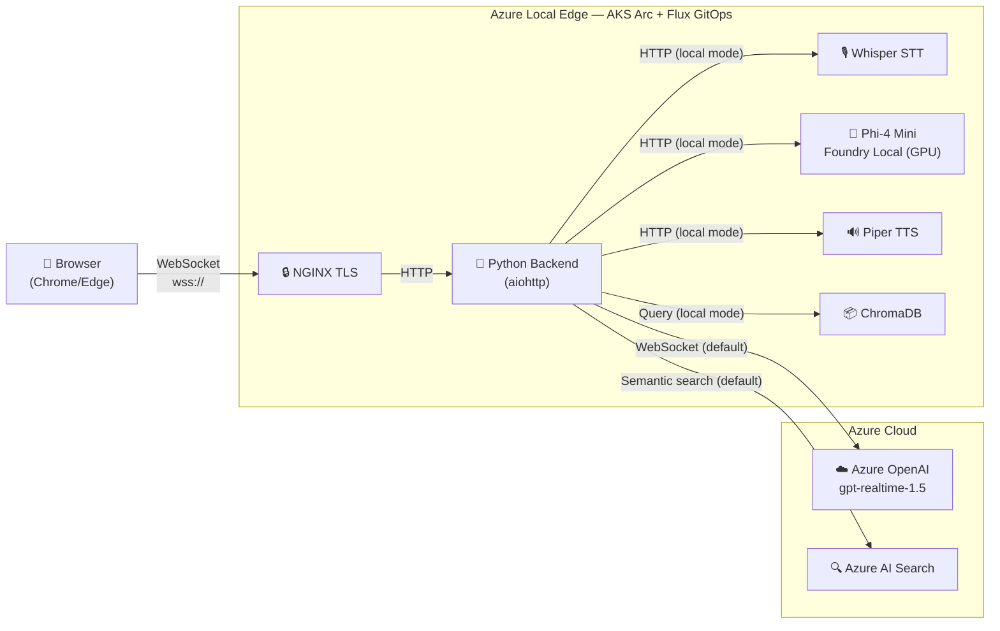

# Dunkin' AI Voice Ordering — 8-Minute Demo Script

**Audience:** Technical decision-makers, partners, internal stakeholders
**Goal:** Show a real AI workload running at the edge on Azure Local, highlight
**Foundry Local** as the enabler for on-premises AI inference, and demonstrate
the guest + crew experience end to end.

---

> ### 💡 Prerequisites
>
> - Two browser tabs open: **guest experience** (`https://<your-domain>`) and
>   **crew dashboard** (`https://<your-domain>/crew`).
> - Microphone permissions granted, audio working.
> - Accept the self-signed certificate warning.
> - Know the current time — if between 2–5 PM, happy hour pricing is active.
>
> ### ⚠️ Authentication Note
>
> Deployments are **public by default** (no sign-in required).  Entra ID
> authentication is opt-in via `AZURE_AUTH_ENABLED=true`.  See the
> [README](../README.md#getting-started) for details.

---

## [0:00 – 1:00] HOOK — The Problem & The Promise

> "Imagine you pull into a Dunkin' drive-through lane.  You talk to the speaker.
> An AI takes your order — in your language — instantly.  It knows the menu, it
> handles substitutions, and it does it all in real time.
>
> But here's what makes this different: the application is deployed on **Azure
> Local** — on-premises hardware running AKS Arc — and when the feature flag is
> enabled, the AI model itself runs right there on the same cluster using
> **Foundry Local**.
>
> Today I'll show you a working AI voice-ordering system with two views — the
> **guest** placing an order and the **crew** managing the lane — and we'll
> explore how it moves between cloud and edge inference.  Let me walk you
> through it."

---

## [1:00 – 2:30] ARCHITECTURE OVERVIEW

> *[Show the architecture diagram or put it on-screen]*



> "There are two operating modes — controlled by a single environment variable:
>
> **Hybrid (default, `USE_LOCAL_PIPELINE=false`):**
>
> - The Python backend on AKS Arc forwards audio to **Azure OpenAI
>   gpt-realtime-1.5** — the GA realtime model on the `/openai/v1/realtime`
>   surface.  Speech-to-text, reasoning, and text-to-speech happen in one
>   streaming WebSocket connection.  Sub-second latency.
> - Menu retrieval uses **Azure AI Search** with semantic hybrid search.
> - An NGINX TLS sidecar handles encrypted WebSocket connections from the browser.
>
> **Fully-local (opt-in, `USE_LOCAL_PIPELINE=true`):**
>
> - **Whisper** for speech-to-text, **Foundry Local running Phi-4 Mini on GPU**
>   for reasoning and tool calling, and **Piper** for text-to-speech — all as
>   Kubernetes pods on the same cluster.
> - Menu search switches to **ChromaDB** with ONNX MiniLM-L6-v2 embeddings
>   baked into the container.
> - No cloud dependency at all — air-gapped capable.
>
> Both modes use the same frontend, same WebSocket endpoint, same backend app
> code.  The choice is a deploy-time flag, not a code change."

---

## [2:30 – 4:30] LIVE DEMO — Voice Ordering + Crew View

> *[Arrange guest experience and crew dashboard side by side]*
>
> "Let me show you this live.  On the left is the **guest** view — what a
> customer sees on the speaker screen.  On the right is the **crew dashboard**
> — what the Dunkin' team sees behind the counter.
>
> *[Click the orange microphone button]*
>
> — 'Hey, good morning!  Can I get a large iced coffee?'
>
> *[Wait for response — point out real-time transcription, order panel updating,
> spoken response]*
>
> Notice: the transcription happens in real time.  The model searched the menu
> via a tool call and added the item with the correct price.
>
> — 'Actually, can you recommend something for someone who doesn't drink coffee?'
>
> *[AI responds with a recommendation]*
>
> — 'The apple juice sounds great.  Also, add a bacon egg and cheese sandwich.'
>
> Now let me show something fun — let me push the limits:
>
> — 'Can I get 12 glazed donuts?'
>
> *[AI refuses — explains max 10 per item, offers to add 10]*
>
> See that?  There are business rules built in.  Max 10 per item, max 25 per
> order.  The AI explains the limit conversationally — no ugly error messages.

*(If between 2–5 PM):*

> Notice the pricing — we're in **happy hour** right now.  Cold beverages and
> signature lattes are 25% off between 2 and 5 PM.  That iced coffee price
> reflects the discount automatically.

> — 'That's everything.  How much is the total?'
>
> *[AI reads back the order with total]*
>
> Now look at the **crew dashboard** — *[point to right tab]* — the crew sees
> lane status, cars in queue, order details, all updating in real time via
> WebSocket.  This is the operator view that would run on a tablet behind the
> counter.
>
> *[Show Demo Controls: click Spawn Car or Start Demo to show fleet behavior]*
>
> These demo controls let you simulate a drive-thru lane — spawn cars, complete
> orders, reset the lane.  For a live demo to stakeholders, you can start the
> auto-fleet and narrate the operational story."

---

## [4:30 – 5:00] VOICE PICKER

> "One more UI feature — open Settings.  See the voice picker?  There are **ten
> GA voices** available: alloy, ash, ballad, coral, echo, sage, shimmer, verse,
> marin, cedar.  Each has a short descriptor.
>
> *[Change voice to 'shimmer' or 'echo']*
>
> This takes effect **immediately** — no redeploy.  The browser sends the choice
> to the middle tier, which issues a `session.update` to the realtime model.
> The next response comes back in the new voice.  It persists across page
> refreshes via localStorage."

---

## [5:00 – 6:00] FOUNDRY LOCAL — The Edge AI Story

> "Now let me dig into **Foundry Local**, because this is what makes the fully-
> local mode possible.
>
> Foundry Local is Microsoft's framework for running AI models on your own
> hardware.  It provides a Kubernetes operator — you declare a
> `ModelDeployment` CRD specifying the model name and compute type, and the
> operator handles pulling the model, scheduling it on GPU, and exposing an
> OpenAI-compatible API.
>
> *[Show or reference the deployment YAML]*
>
> ```yaml
> apiVersion: foundrylocal.azure.com/v1
> kind: ModelDeployment
> metadata:
>   name: phi-4-mini-gpu
> spec:
>   model:
>     catalog:
>       name: Phi-4-mini-instruct-cuda-gpu
>       version: "5"
>   compute: gpu
>   replicas: 1
> ```
>
> That's 12 lines.  The app calls it using the same `/v1/chat/completions` API
> it would use for Azure OpenAI.  **Same code, different endpoint.**
>
> In fully-local mode, Whisper transcribes → Phi-4 Mini reasons and calls
> tools → Piper synthesizes speech.  The whole pipeline stays on-prem.
>
> **The tradeoff:** Hybrid gives ~200 ms and the best voice quality.  Fully-local
> gives ~10–20 seconds per turn — but for air-gapped, sovereign, or
> connectivity-constrained environments, a 15-second response is infinitely
> better than no response at all.
>
> For the detailed local architecture, see
> [foundry-local-architecture.md](../docs/foundry-local-architecture.md)."

---

## [6:00 – 7:00] EDGE ADVANTAGES — Why Run AI at the Edge?

> "Five reasons to run AI at the edge:
>
> 1. **Data sovereignty.** Menu data, pricing, customer preferences stay
>    on-prem.  For regulated industries — healthcare, defense, financial
>    services — this is non-negotiable.
>
> 2. **Latency.** When AI is local, you eliminate the cloud round-trip.  For
>    real-time voice, every millisecond counts.
>
> 3. **Resilience.** If the internet goes down, the store doesn't stop.  Foundry
>    Local keeps Phi-4 Mini running.  No cloud dependency, no single point of
>    failure.
>
> 4. **Cost at scale.** 10,000 locations streaming every audio interaction to
>    the cloud is expensive.  Local inference on commodity GPU hardware drops
>    per-location cost dramatically.
>
> 5. **Compliance.** Some environments simply can't send data to the cloud.
>    Foundry Local makes those deployments possible."

---

## [7:00 – 7:45] THE PLATFORM — Azure Local, AKS Arc, GitOps

> "The platform that makes this possible:
>
> - **Azure Local** — Microsoft's on-premises cloud infrastructure.  Same Azure
>   services, running in your facility.  Provides GPU-capable nodes for Foundry
>   Local.
> - **AKS Arc** — Managed Kubernetes on Azure Local.  The entire app — backend,
>   NGINX, model deployments — runs as Kubernetes workloads.
> - **Flux v2 GitOps** — Deploys everything including the Foundry Local model.
>   Push a change to GitHub, Flux reconciles.  Roll out a new model to
>   thousands of edge locations by merging a PR.
>
> The app container is **383 MB** (down from 8.9 GB).  Pre-built vector index,
> frontend assets, all Python dependencies.  Fast to pull, fast to start.
>
> Full deployment details are in
> [azure-local-deployment.md](../docs/azure-local-deployment.md)."

---

## [7:45 – 8:00] CLOSE — The Takeaway

> "What we showed today is a **working AI application** — voice ordering,
> real-time RAG, tool calling, multi-language support, and a crew operations
> view — running on real edge hardware with Azure Local and AKS Arc.
>
> Key takeaways:
>
> - **Azure Local + AKS Arc** gives you cloud-native Kubernetes at the edge
> - **Foundry Local** puts production-quality SLMs on your own hardware
> - **GitOps with Flux** makes deployment hands-off and repeatable
> - You **choose your trade-offs** — cloud AI for best quality, local AI for
>   full sovereignty, or both in a hybrid model
> - The **crew dashboard** makes this an operational story, not just a tech demo
>
> Edge AI isn't a future thing.  It's running right now.  Thank you."

---

## Speaker Notes

### Key talking points if asked

| Question | Answer |
|----------|--------|
| What model powers the live voice? | **gpt-realtime-1.5** (GA, version 2026-02-23) on the `/openai/v1/realtime?model=` surface. |
| What about the old gpt-4o-realtime-preview? | Retired.  Cannot be provisioned.  We migrated to the GA surface. |
| What model runs locally? | Phi-4 Mini Instruct (CUDA GPU, version 5) via Foundry Local operator. |
| How does local compare to cloud? | Same app code, different endpoint.  Cloud ≈ 200 ms.  Local ≈ 10–20 s.  One env var toggles. |
| What's the default menu search? | Azure AI Search with semantic hybrid.  ChromaDB is the local-only alternative. |
| Is there authentication? | Public by default.  Entra ID is opt-in via `AZURE_AUTH_ENABLED`.  See README. |
| How is this deployed? | Flux GitOps reconciles from GitHub to AKS Arc.  See `docs/azure-local-deployment.md`. |
| Container size? | 383 MB optimized image. |
| Multi-language? | Yes — gpt-realtime-1.5 handles transcription and translation for English, Spanish, Mandarin, French, and more. |
| What voices are available? | Ten GA voices in the settings picker: alloy, ash, ballad, coral, echo, sage, shimmer, verse, marin, cedar. |
| What are the ordering limits? | 10 per item, 25 per order.  Configured in `config.yaml`. |
| What's happy hour? | 25% off cold beverages and signature lattes, 2–5 PM store time.  Automatic. |
