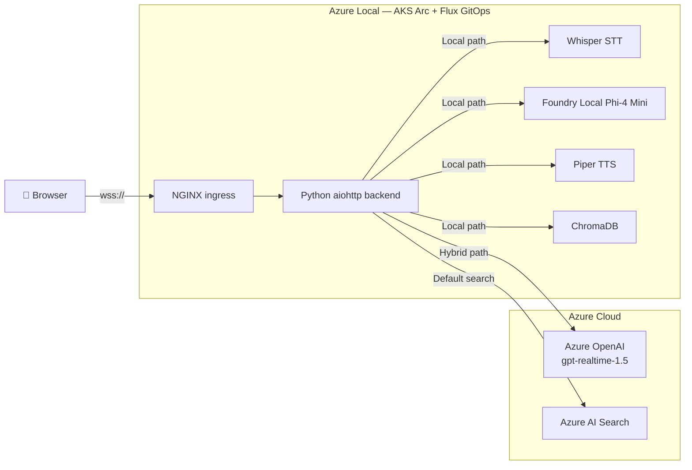

# Dunkin' AI Voice Ordering — Demo Guide

This is the consolidated presenter guide for live demonstrations of the Dunkin
Voice Chat Assistant.  It covers what to show, what to say, likely questions,
and quick-reference talking points at multiple lengths.

For the full **8-minute narrated script**, see
[Demo/8-minute-demo-script.md](Demo/8-minute-demo-script.md).
For the **Foundry Local architecture** (opt-in fully-local mode), see
[foundry-local-architecture.md](foundry-local-architecture.md).
For **edge deployment** details, see
[azure-local-deployment.md](azure-local-deployment.md).

---

## Quick Reference (Talking Points at Every Length)

### 30-Second Version

> "This is a voice ordering assistant running on Azure Local.  The guest speaks
> into the browser, the request goes through Kubernetes ingress to an
> edge-hosted Python backend, and the live deployment uses **Azure OpenAI
> gpt-realtime-1.5** for sub-second voice interaction.  Menu retrieval and order
> logic stay local on the edge using Azure AI Search (cloud default) or
> ChromaDB (opt-in local).  We also support a fully-local path using Whisper,
> Foundry Local with Phi-4 Mini, and Piper when `USE_LOCAL_PIPELINE=true`."

### 2-Minute Version

> "What makes this interesting is that it's not just a chatbot in a browser.
> It's an edge application running on Azure Local with a real Kubernetes
> deployment model.
>
> In the default deployment, **Azure OpenAI gpt-realtime-1.5** provides fast
> speech-to-text, reasoning, and text-to-speech over a single streaming
> WebSocket—the GA `/openai/v1/realtime` surface.  Menu search is powered by
> **Azure AI Search** with semantic hybrid retrieval.
>
> The repo also supports a fully-local mode gated by `USE_LOCAL_PIPELINE=true`.
> In that path, Whisper performs transcription, Foundry Local hosts Phi-4 Mini
> for reasoning and tool use, ChromaDB handles menu search, and Piper handles
> text-to-speech—no cloud dependency at all.
>
> There's also a crew dashboard (`app/employee-dashboard/`) that shows real-time
> lane status, car queue, and order details—so you can demo guest *and*
> operator views side by side."

### 5-Minute Version

1. Open the guest experience and the crew dashboard side by side.
2. Explain that the active deployment is on Azure Local, managed by Flux GitOps.
3. Call out that the default deployment uses **gpt-realtime-1.5** (GA) for the
   live voice loop.
4. Place an order by voice.  Point out the real-time transcription, order panel
   updates (tool calls), and natural response.
5. Show quantity limits (try ordering 12 of something) and happy hour behavior.
6. Switch to the crew dashboard—show lane status, Demo Controls (spawn car,
   complete order, reset lane).
7. If you have cluster access, show the Foundry Local model deployment and
   explain that `USE_LOCAL_PIPELINE=true` swaps the reasoning path to Phi-4 Mini.
8. Close: hybrid is used for live responsiveness; fully-local is available when
   cloud dependency must be minimized.

---

## Demo Access

| Item | Value |
|---|---|
| Guest experience | `https://<your-domain>` |
| Employee dashboard | `https://<your-domain>/crew` |
| Browser | Edge or Chrome (microphone requires HTTPS) |
| TLS | Self-signed certificate — accept the browser warning |
| Start | Click the orange microphone button |

> **Note:** Deployments are **public by default**.  Authentication is opt-in via
> `AZURE_AUTH_ENABLED=true` (Microsoft Entra ID).  See the
> [README](../README.md#getting-started) authentication callout for details.

---

## What This Demo Proves

1. A **real-time voice ordering** experience that feels like a drive-thru, not a chatbot.
2. An **edge architecture** where the app runtime, retrieval, and order logic
   stay local on Azure Local.
3. A **split between a production-ready hybrid path** and a fully-local path
   using Foundry Local—demonstrating architectural flexibility.
4. An **operational crew view** (dashboard) that makes the demo tangible for
   franchise operators, not just technologists.

---

## Operating Modes

| Mode | `USE_LOCAL_PIPELINE` | Speech-to-text | LLM | Text-to-speech | Menu retrieval | Typical latency |
|---|---|---|---|---|---|---|
| **Hybrid (default)** | `false` | Azure OpenAI Realtime | `gpt-realtime-1.5` (GA) | Azure OpenAI Realtime | Azure AI Search | ~200 ms |
| **Fully-local (opt-in)** | `true` | Whisper (edge) | Foundry Local Phi-4 Mini (edge) | Piper (edge) | ChromaDB (edge) | ~10–20 s |

---

## Architecture (One-Slide Mermaid)



---

## Voice Picker

The settings dialog exposes **ten GA realtime voices**: alloy, ash, ballad,
coral, echo, sage, shimmer, verse, marin, cedar.

- Change takes effect **immediately** on the live conversation — no redeploy
  needed.
- The selection persists in the browser (`localStorage`) and is sent to the
  middle tier, which issues a `session.update` with
  `audio.output.voice`.
- The initial default is `coral` (configured in `app/backend/config.yaml` →
  `model.default_voice`).

**Demo tip:** Switch voices mid-conversation to show the live-swap capability.

---

## Business Rules the Presenter Should Know

| Rule | Behavior | Configuration |
|---|---|---|
| **Happy hour** | 25% off cold beverages and signature lattes, 2–5 PM store time | `config.yaml` → `business_rules.happy_hour_*` |
| **Quantity limits** | Max 10 per item+size; max 25 items per order | `config.yaml` → `max_item_quantity`, `max_order_items` |
| **Extras validation** | Whipped cream, flavour swirls, espresso shots are only valid on signature lattes and cold beverages; refused conversationally on other items | Backend `extras_rules` |

**Why this matters for a live demo:** If you order 12 large iced coffees the AI
will refuse and offer to add 10.  If you ask for whipped cream on a donut the
AI will politely decline.  Know these limits so you can either demonstrate them
intentionally or avoid tripping over them by accident.

---

## Employee Dashboard (Crew View)

The dashboard lives at `app/employee-dashboard/` and displays:
- **Lane status** — cars queued, current order in progress
- **Order details** — items, totals, real-time updates via WebSocket
- **Demo controls** — Spawn Car, Complete Order, Reset Lane, Demo Mode toggle

### Running Locally

```bash
cd app/employee-dashboard
npm install && npm run dev   # port 4174 by default
```

### Demo Controls

| Button | Effect |
|---|---|
| **Start Demo** | Starts auto-spawning a fleet of cars with simulated orders |
| **Pause Demo** | Stops fleet auto-run |
| **Add Demo Car** | Spawns a single car into the lane |
| **Complete Order** | Advances the current car through the lane |
| **Reset Lane** | Clears all cars and orders |

**Demo tip:** Open the crew dashboard in a second browser tab/window and
arrange side-by-side with the guest experience.  Place a voice order and watch
it appear on the crew side in real time.

---

## What Stays Local Even in Hybrid Mode

Even when the voice path uses Azure OpenAI Realtime, these remain on-premises:

- The application container and session logic
- Tool execution (order state, totals, business rules)
- The Kubernetes runtime, networking, ingress, and GitOps deployment model
- The drive-thru simulator and employee dashboard backend

The hybrid dependency is specifically the voice-and-reasoning stream and Azure
AI Search for menu retrieval.

---

## Live Demo Sequence (Recommended)

1. Open the guest experience and crew dashboard **side by side**.
2. Explain the cluster is on Azure Local—managed by Flux GitOps.
3. **Place an order** by voice: "Can I get a large iced coffee and a glazed donut?"
4. Point out: real-time transcription, order panel updating via tool calls, spoken response.
5. Show **happy hour** (if between 2–5 PM) or explain the rule and show a price example.
6. Demonstrate a **quantity limit**: "Give me 12 large iced coffees." → AI refuses politely, offers 10.
7. Switch to the crew dashboard — show the lane and Demo Controls.
8. If you have cluster access, `kubectl get modeldeployments -n foundry-local-operator` to show the local model.
9. Close with the tradeoff message: hybrid for speed, fully-local for sovereignty.

---

## Cluster View (If You Have Terminal Access)

### Core app and ingress

```bash
kubectl get pods -n dunkin-voice
kubectl get svc -n dunkin-voice
kubectl get ingress -n dunkin-voice
kubectl logs deploy/dunkin-voice-assistant -n dunkin-voice -c dunkin-voice --tail=50
```

### Foundry Local model deployment

```bash
kubectl get modeldeployments -n foundry-local-operator
kubectl describe modeldeployment phi-4-mini-gpu -n foundry-local-operator
```

### Optional local speech services (fully-local mode)

```bash
kubectl get deploy,svc -n dunkin-voice | grep -E "whisper|piper"
```

---

## Likely Questions

| Question | Answer |
|---|---|
| What model powers the live voice? | **gpt-realtime-1.5** (GA, version 2026-02-23) on the `/openai/v1/realtime?model=` surface. |
| Why isn't everything fully local? | Hybrid gives ~200 ms latency and best voice quality. Fully-local is available when cloud dependency must be minimized. |
| What stays local in hybrid mode? | App container, session state, tool execution, Kubernetes runtime, crew dashboard. The cloud dependency is specifically voice+reasoning (Azure OpenAI) and menu search (Azure AI Search). |
| What is Foundry Local? | Microsoft's framework for running AI models on your own hardware—Kubernetes operator + model catalog + OpenAI-compatible API. |
| Is the demo authenticated? | Public by default. Entra ID auth is opt-in via `AZURE_AUTH_ENABLED=true`. |
| What about menu search? | Default: Azure AI Search (semantic hybrid). Opt-in local: ChromaDB with ONNX MiniLM-L6-v2 embeddings. |
| Container size? | 383 MB optimized image (down from 8.9 GB). |
| Multi-language? | Yes — gpt-realtime-1.5 handles transcription and translation across English, Spanish, Mandarin, French, and more. In local mode, Whisper provides multi-language STT. |

---

## Useful Repo References

| Topic | Path |
|---|---|
| Mode switching | `app/backend/app.py` (`RTMiddleTier` vs `RTLocalPipeline`) |
| Realtime middle tier | `app/backend/rtmt.py` |
| Local pipeline | `app/backend/rtmt_local.py` |
| Business rules config | `app/backend/config.yaml` |
| Foundry Local manifest | `flux/apps/foundry-models/phi4-mini-deployment.yaml` |
| Flux configmap | `flux/apps/dunkin-voice/configmap.yaml` |
| WebSocket ingress | `flux/apps/dunkin-voice/ingress.yaml` |
| Edge deployment guide | `docs/azure-local-deployment.md` |
| Foundry Local architecture | `docs/foundry-local-architecture.md` |

---

## Good Closing Line

> "The point of this demo is not just that voice ordering works.  It's that the
> same edge-hosted application can either use a cloud realtime model for the
> best live experience, or swap to a local model stack with Foundry Local when
> deployment constraints demand it—and the crew view makes it a real operational
> story, not just a tech demo."
