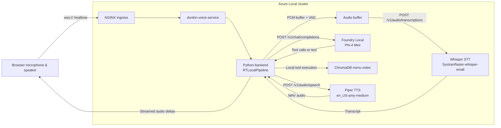

# Foundry Local Architecture

> **Applies only when `USE_LOCAL_PIPELINE=true`.**
> The default deployment uses Azure OpenAI `gpt-realtime-2.1` (GA) for voice
> and reasoning over the `/openai/v1/realtime?model=` surface.  This page
> describes the **opt-in, fully-local** pipeline that replaces the cloud path
> with edge-hosted models when the feature flag is enabled.

## Purpose

Use this diagram when the audience wants to understand how the app runs
**entirely on-premises** — no Azure OpenAI dependency.  For the default hybrid
architecture and deployment steps, see
[azure-local-deployment.md](azure-local-deployment.md).

## Fully-Local Flow

## Step-by-Step Explanation

1. The browser still connects to the same `/realtime` WebSocket endpoint.
2. The backend switches from the cloud realtime path (`RTMiddleTier`) to `RTLocalPipeline`.
3. Audio is buffered locally and checked with simple voice activity detection.
4. **Whisper** converts buffered audio into text.
5. The backend sends the transcript and conversation state to the **Foundry Local** endpoint.
6. **Phi-4 Mini** can answer directly or issue tool calls (menu search, order updates).
7. Tool calls execute inside the backend against local order state and local ChromaDB.
8. The final response text is sent to **Piper**, which returns synthesized audio.
9. The backend streams that audio back to the browser.

## What Foundry Local Owns

Foundry Local is responsible for the **reasoning step** in the fully-local path.

| Item | Value |
|---|---|
| Namespace | `foundry-local-operator` |
| Model deployment | `phi-4-mini-gpu` |
| Model catalog entry | `Phi-4-mini-instruct-cuda-gpu` |
| Version | `5` |
| Endpoint pattern | `/v1/chat/completions` |
| App-facing URL | `http://phi-4-mini-gpu.foundry-local-operator.svc:5000` |

## What Foundry Local Does Not Own

Foundry Local is **not** the browser entry point, not the ingress layer, not the
speech-to-text engine, and not the text-to-speech engine.  It is the local LLM
service in the middle of the speech pipeline.

## Enabling the Local Pipeline

1. Set `USE_LOCAL_PIPELINE=true` in the environment (configmap or `.env`).
2. Install edge dependencies: `pip install -r requirements-edge.txt`.
3. Deploy Whisper, Piper, and the Foundry Local model — the manifests live in
   `flux/apps/whisper-stt/`, `flux/apps/piper-tts/`, and
   `flux/apps/foundry-models/`.  Enable them by uncommenting lines in
   `flux/apps/kustomization.yaml`.
4. The edge container image (`Dockerfile.edge`) bundles all local-pipeline
   dependencies.

For full deployment instructions, see [azure-local-deployment.md](azure-local-deployment.md).

## Relationship to Hybrid Mode

| | Hybrid (default) | Fully-Local (opt-in) |
|---|---|---|
| Feature flag | `USE_LOCAL_PIPELINE=false` | `USE_LOCAL_PIPELINE=true` |
| Speech-to-text | Azure OpenAI Realtime | Whisper (edge) |
| Reasoning / LLM | Azure OpenAI `gpt-realtime-2.1` | Foundry Local Phi-4 Mini (edge) |
| Text-to-speech | Azure OpenAI Realtime | Piper TTS (edge) |
| Menu search | Azure AI Search (cloud) | ChromaDB (edge) |
| Typical latency | ~200 ms | ~10–20 s |
| Cloud dependency | Azure OpenAI + Azure AI Search | None |

## Demo Narration

> "In fully-local mode, the browser still talks to the same backend.  What
> changes is the voice pipeline behind that backend.  Instead of forwarding audio
> to Azure OpenAI Realtime, the app transcribes locally with Whisper, reasons
> locally through a Foundry Local–hosted Phi-4 Mini endpoint, executes tools
> against local state and ChromaDB, and synthesizes audio locally with Piper.
> Foundry Local is the LLM serving layer that keeps the reasoning step on the
> edge."
